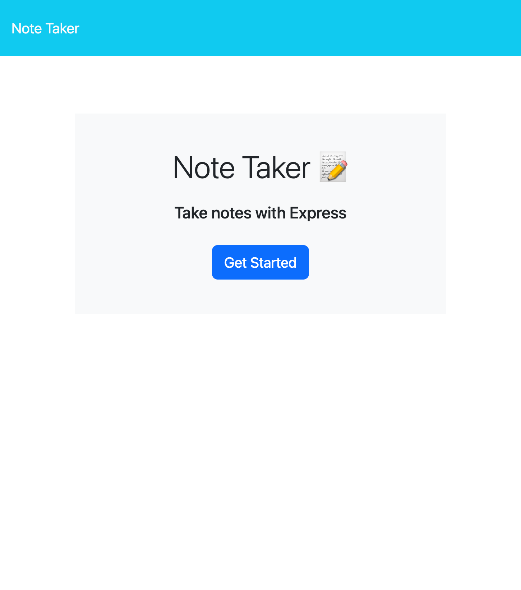

# take-notes-11

## Description

This project was designed to give functionality to a note taking frontend application by using backend tools such as express.js and Node.js. My motivation for work through this application was to implement the express.js and node.js and run the website on the server. Also the user will be able to take notes and save and delete their notes as they please.

## Installation

- npm install uuid
- npm i express.js

## Usage

when the app is open the user is presented with a landing page to start taking notes once the button is clicked.

Then the user is able to enter notes and save them.

.png)

The user is also able to delete there note history as well.

.png)

## Credits

- Sarah Miller
- Matthew Lomard
- Chris Snyder
- Hakim Teasdell

## License

MIT License

